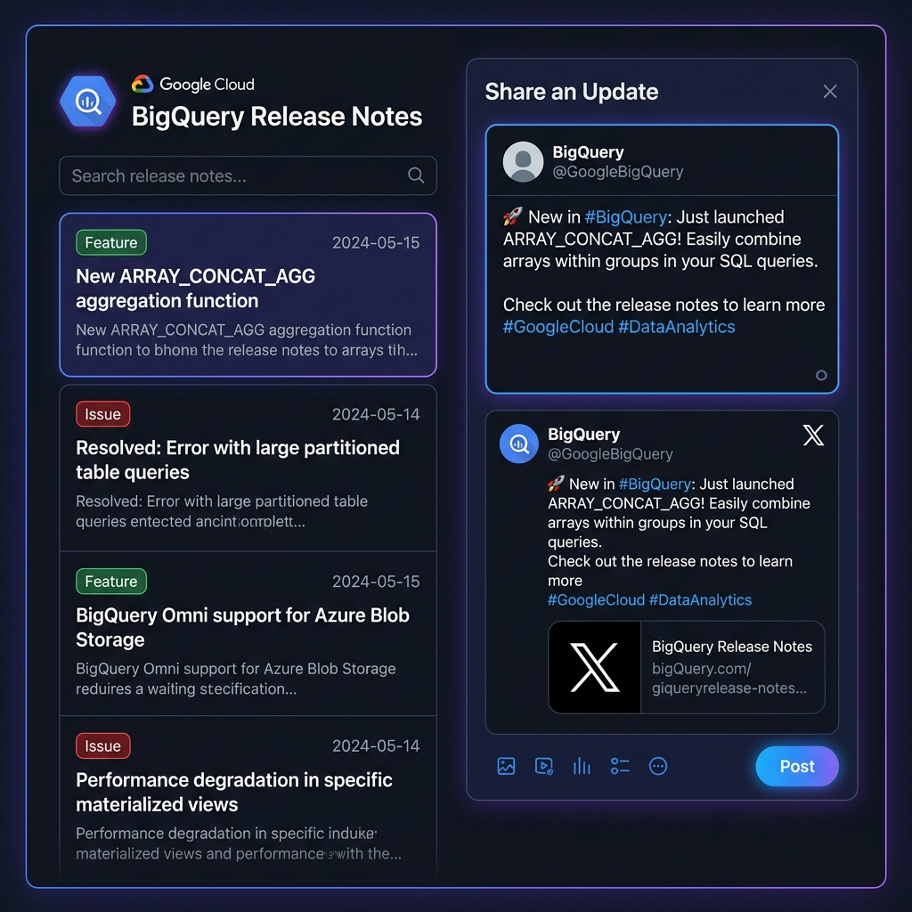
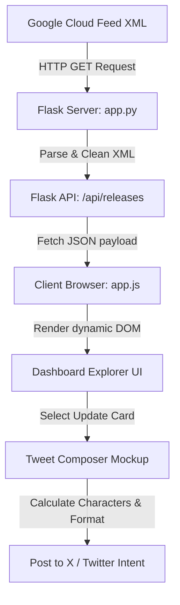

# BigQuery Release Notes Explorer 🚀

A premium, interactive web application to fetch, search, filter, and share Google Cloud BigQuery release notes. Built with Python Flask on the backend and modern vanilla HTML, CSS, and JavaScript on the frontend.

## UI Visualisation
Below is a visual mockup of the dashboard interface, featuring the dark mode layout, categorical badges, search filtering, and the interactive Tweet composer.



---

## Architecture Flow

The following diagram outlines the application's data flow, from fetching the live Google Cloud feed to sharing updates on social media:



---

## Features

- **Live XML Feed Fetcher:** Parses release logs dynamically from the official Google Cloud BigQuery Atom feed.
- **Granular Update Card Layout:** Automatically splits single-day logs into category-specific cards:
  - 🟢 **Features**
  - 🔴 **Issues / Fixes**
  - 🟡 **Changed**
  - 🟠 **Deprecations**
  - 🔵 **General Announcements**
- **Instant Search:** Client-side indexing to filter logs in real-time as you type.
- **In-Memory Caching:** Prevents speed bottlenecks and API rate limits while allowing a manually triggered refresh.
- **Interactive X/Twitter Composer:** Auto-generates tweets with hashtags (`#BigQuery #GCP`) and links, truncating text intelligently to stay within the 280-character limit. Includes a visual progress circular indicator.

---

## Tech Stack

- **Backend:** Python 3.13+, Flask
- **Frontend:** Vanilla HTML5, CSS3, JavaScript (ES6)
- **Typography:** Outfit & JetBrains Mono (Google Fonts)

---

## Local Setup & Execution

### 1. Prerequisites
Ensure you have Python installed:
```bash
python --version
```

### 2. Install Dependencies
Install Flask and standard packages (if not already installed):
```bash
pip install flask requests
```

### 3. Run the Application
Start the Flask server from the repository root:
```bash
python app.py
```
By default, the server will start in debug mode on **`http://127.0.0.1:5000`**. Open this link in your browser to run the app.

---

## Project Structure

- `app.py`: Flask backend, cache coordinator, and XML parsing engine.
- `templates/index.html`: Main HTML template with responsive layout structure.
- `static/style.css`: Stylesheet implementing dark theme, custom scrollbars, animations, and progress rings.
- `static/app.js`: State manager, search filtering, card selection listeners, and character validation.
- `static/ui_mockup.jpg`: UI interface design preview.
- `.gitignore`: Pattern rules to prevent staging cache/environment files.
